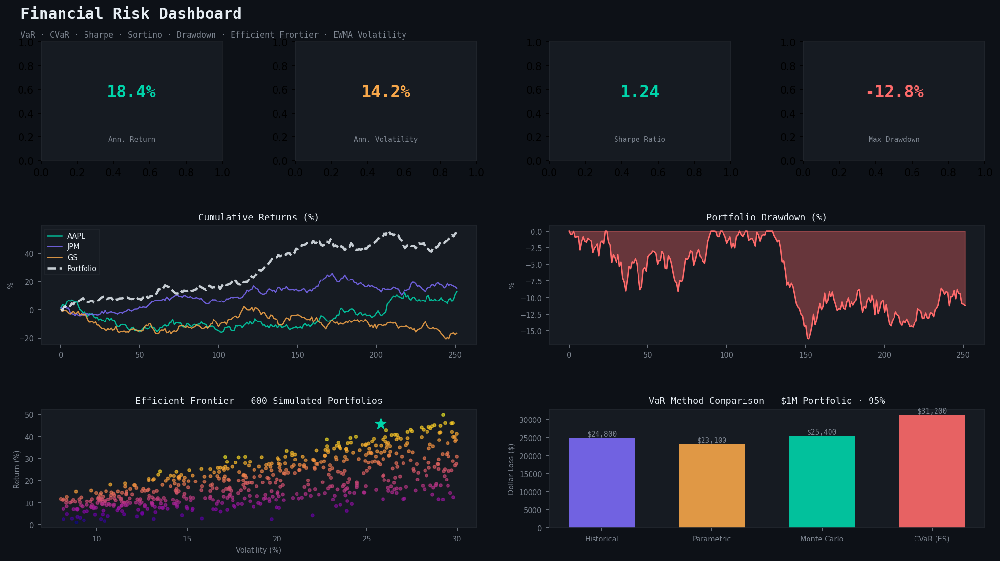

# Financial Risk Dashboard 📉

> Institutional-grade quantitative risk analytics — VaR (3 methods), CVaR, Sharpe, Sortino, Calmar, Beta, Max Drawdown, EWMA Volatility, Efficient Frontier, and more. Built with real market data.

**Built by [Darsh Jogani](https://www.linkedin.com/in/darsh-jogani-37b97218b)** | MS Business Analytics & AI, UT Dallas | FRM Part 1 Cleared · Part 2 Nov 2026



---

## Overview

A production-grade financial risk analytics platform aligned with **FRM (Financial Risk Manager) curriculum**. Pulls real market data via yfinance, computes institutional risk metrics, and presents them through an interactive multi-tab Streamlit dashboard with portfolio optimization and efficient frontier visualization.

This project directly reflects the quantitative risk knowledge from FRM Part 1 & 2 — covering Market Risk, Risk Measures, Portfolio Theory, and Volatility Models (GARP curriculum).

---

## Features

### Risk Engine (`risk_engine.py`)
| Metric | Method | FRM Reference |
|--------|--------|---------------|
| Value at Risk | Historical, Parametric, Monte Carlo | Market Risk · Basel III |
| Expected Shortfall (CVaR) | Historical simulation | Coherent risk measure |
| Sharpe Ratio | Annualized excess return / vol | Performance Attribution |
| Sortino Ratio | Downside deviation only | Non-normal distributions |
| Calmar Ratio | Ann. return / max drawdown | Hedge fund analytics |
| Beta | CAPM market sensitivity | Equity risk factor |
| Jensen's Alpha | Excess CAPM return | Active management |
| EWMA Volatility | RiskMetrics λ=0.94 | JP Morgan methodology |
| Max Drawdown | Peak-to-trough | Risk-adjusted performance |
| Information Ratio | Active return / tracking error | Active vs passive |

### Portfolio Module (`portfolio.py`)
- Multi-asset portfolio construction with custom weights
- Component VaR — risk decomposition per asset
- Portfolio optimization: Max Sharpe, Min Vol, Min VaR
- Efficient frontier via 800-portfolio Monte Carlo simulation
- Correlation and covariance matrix (annualized)

### Dashboard (`dashboard.py`) — 5 Tabs
- **Returns** — Cumulative returns, distribution histograms, rolling/EWMA volatility
- **Risk Metrics** — Drawdown chart, per-asset risk table with conditional formatting
- **Correlation** — Heatmap + rolling 63-day correlation between assets
- **Portfolio** — Weights pie, component VaR bars, efficient frontier scatter
- **VaR Analysis** — Three-method comparison, rolling VaR, FRM interpretation note

---

## Setup

```bash
git clone https://github.com/Darish999/Financial-Risk-Dashboard.git
cd Financial-Risk-Dashboard
pip install -r requirements.txt
streamlit run dashboard.py
```

MySQL logging is optional — the dashboard runs fully without it.

---

## Project Structure

```
financial-risk-dashboard/
├── data_fetcher.py    # yfinance wrapper — prices, returns, benchmark
├── risk_engine.py     # VaR, CVaR, Sharpe, Sortino, Beta, Drawdown, EWMA
├── portfolio.py       # Multi-asset portfolio, optimization, efficient frontier
├── db_logger.py       # MySQL risk snapshot logging (optional)
├── dashboard.py       # Streamlit dashboard — 5 analytical tabs
├── preview.py         # Generates repo preview image
├── requirements.txt
└── README.md
```

---

## Key Risk Concepts (FRM Aligned)

**Value at Risk (VaR):** At 95% confidence over 1 day, there is a 5% probability of losing more than the VaR amount.
- *Historical*: Uses empirical return distribution — no normality assumption
- *Parametric*: Assumes normal distribution (RiskMetrics / variance-covariance)
- *Monte Carlo*: Simulates 10,000 future return paths

**CVaR / Expected Shortfall:** Average loss in the worst 5% of scenarios. Coherent risk measure — preferred over VaR under Basel III (FRTB).

**EWMA Volatility:** JP Morgan's RiskMetrics model with λ=0.94, giving more weight to recent observations.

---

## Tech Stack

| Layer | Technology |
|-------|-----------|
| Data | yfinance, pandas, NumPy |
| Risk Math | SciPy, NumPy |
| Optimization | scipy.optimize |
| Storage | MySQL 8.0 (optional) |
| Dashboard | Streamlit, Plotly |
| Preview | matplotlib |

---

## About the Author

**Darsh Jogani** — Business & Finance Analyst building end-to-end data and risk infrastructure. FRM Part 1 cleared, Part 2 registered for November 2026.

🔗 [LinkedIn](https://www.linkedin.com/in/darsh-jogani-37b97218b) · [Portfolio](https://darish999.github.io/Darshjogani.github.io/) · [GitHub](https://github.com/Darish999)
